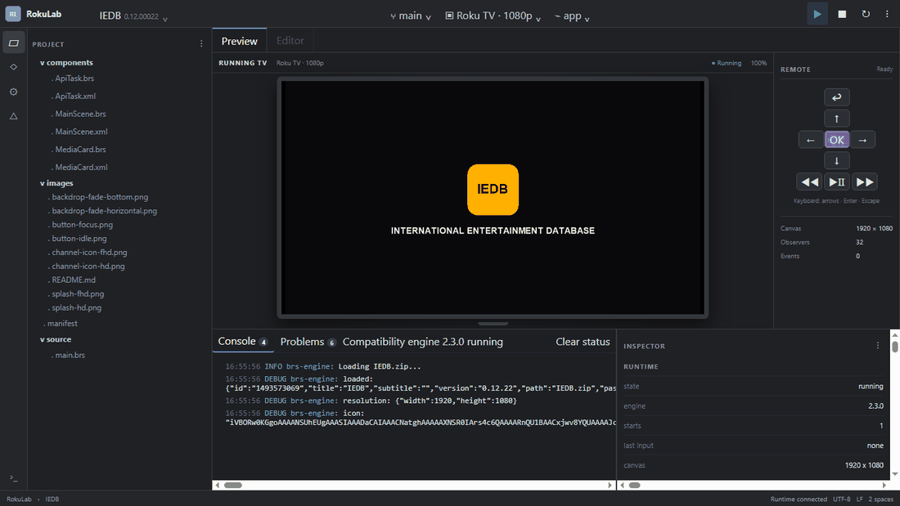
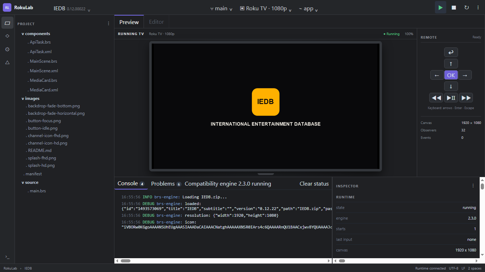
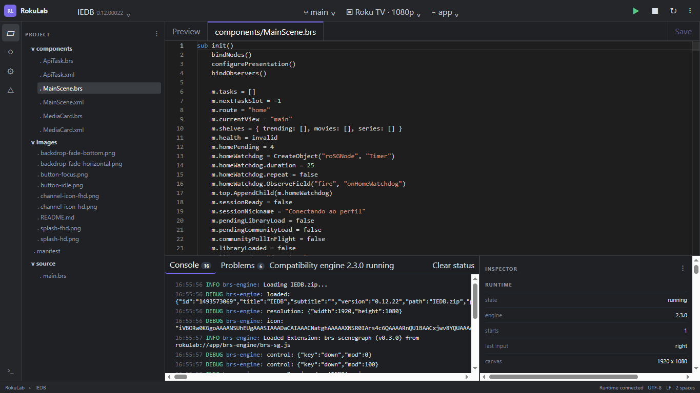

# RokuLab

<p align="center">
  <strong>The missing local development environment for Roku.</strong><br />
  Open, edit, run, inspect, and test BrightScript + SceneGraph projects on your computer.
</p>

<p align="center">
  <a href="https://github.com/gadevsbr/RokuLab/releases/download/v0.1.0-alpha.15/RokuLab-0.1.0-alpha.15-windows-x64.exe"><strong>Download the recommended Community Preview for Windows</strong></a>
  ?
  <a href="https://github.com/gadevsbr/RokuLab/releases/tag/v0.1.0-alpha.15">Release notes</a>
  ?
  <a href="https://github.com/gadevsbr/RokuLab/issues/1">Share Community Preview feedback</a>
</p>

> **Recommended test build: `v0.1.0-alpha.15`.** RokuLab is an early community preview with intentionally partial Roku compatibility. It does not emulate or distribute Roku OS, and final validation still belongs on physical Roku hardware.



## What works now

- Open a Roku channel folder or the bundled Hello World example.
- Read the manifest and project tree with a sandboxed Electron filesystem boundary.
- Run multi-file BrightScript and SceneGraph through the experimental `brs-engine` 2.3.0 and `brs-scenegraph` 0.3.0 compatibility adapter.
- Render a 1920 ? 1080 SceneGraph canvas in the TV-first Preview workspace.
- Send directional, OK, Back, playback, and keyboard input through the virtual remote.
- Edit BrightScript, XML, JSON, manifest, and text files in the locally bundled Monaco editor.
- Save explicitly and restart the runtime through serialized hot reload.
- Inspect runtime events, Worker field updates, method calls, strictly correlated observer callbacks,
  available call-site locations, stable live-node addresses, emitted component IDs, parent/child
  relations, current fields, focus paths, and available layout bounds.
- Validate projects from the CLI and surface grouped compatibility diagnostics.
- Run the included automated suite against the bundled channel, packaged Windows app, and the IEDB reference channel.

<table>
  <tr>
    <td></td>
    <td></td>
  </tr>
  <tr>
    <td align="center">Wide TV preview with dedicated remote</td>
    <td align="center">Full-width BrightScript editor</td>
  </tr>
</table>

## Download and run on Windows

1. Download [`RokuLab-0.1.0-alpha.15-windows-x64.exe`](https://github.com/gadevsbr/RokuLab/releases/download/v0.1.0-alpha.15/RokuLab-0.1.0-alpha.15-windows-x64.exe).
2. Run the portable executable; installation is not required.
3. Choose a Roku project folder or open the bundled example.
4. Select **Run** to start the compatibility engine.

Published artifact SHA-256:

```text
3B80CBE8710ED06A6AEF45E55020EAE1C86B1500CACE99F2DB9240E1111CF996
```

### Windows SmartScreen warning

The current community preview is **not certificate-signed**. Windows SmartScreen may therefore show ?Windows protected your PC? or identify the publisher as unknown. Verify that the file came from this repository's Releases page and that its SHA-256 matches the value above. If you trust the verified artifact, choose **More info** and then **Run anyway**. A warning caused by the missing signature does not replace normal security judgment; never run a copy obtained from an unofficial mirror.

## Known limitations

- Compatibility is partial and is not binary-compatible Roku OS emulation.
- Rendering, focus, SceneGraph fields, Roku objects, networking, Tasks, and media behavior do not yet cover every documented Roku surface.
- The live Inspector only shows metadata emitted by the compatibility engine; missing IDs, bounds,
  calls, and source locations remain explicit rather than guessed. Calls expose one emitted call-site
  location when available, not a complete source stack.
- Live Inspector field editing, debugger breakpoints, network tooling, and language-server diagnostics are not implemented yet.
- Hot reload currently performs a safe full runtime restart and resets channel state.
- DRM, proprietary codecs, firmware behavior, certification, and device performance remain physical-device-only gates.
- The published portable currently supports Windows x64 only and is unsigned.
- Real channels may expose unsupported behavior or render differently; please file a compatibility report with a minimal reproducible project when possible.

See the [compatibility matrix](docs/COMPATIBILITY.md), [architecture](docs/ARCHITECTURE.md), and [evidence-gated roadmap](docs/ROADMAP.md) for details.

## Run from source

Requirements: Node.js 22+ and Corepack.

```bash
corepack pnpm install
corepack pnpm dev
```

Before contributing, run:

```bash
corepack pnpm lint
corepack pnpm typecheck
corepack pnpm test
corepack pnpm build
```

## Privacy and legal boundary

Projects stay on the local machine. RokuLab distributes no Roku firmware, fonts, logos, protected assets, or proprietary binaries. Roku is a trademark of Roku, Inc.; RokuLab is independent and is not affiliated with or endorsed by Roku, Inc.

## Community and contributing

Use [GitHub Discussions](https://github.com/gadevsbr/RokuLab/discussions) for ideas and questions, and add first impressions to the [Community Preview feedback issue](https://github.com/gadevsbr/RokuLab/issues/1). Use separate [Issues](https://github.com/gadevsbr/RokuLab/issues) for reproducible bugs and compatibility reports. Read [CONTRIBUTING.md](CONTRIBUTING.md), the [Code of Conduct](CODE_OF_CONDUCT.md), and the [Security Policy](SECURITY.md) before contributing. RokuLab is MIT licensed.
